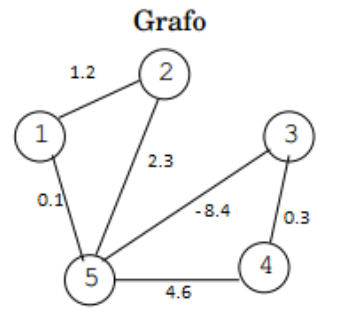

# Graph Theory's assignment
## A biblioteca projetada implementa as seguintes funções:

* Retorna a ordem do grafo
* Retorna o tamanho do grafo
* Retorna os vizinhos de um vértice fornecido
* Determina o grau de um vértice fornecido
* Determina se um grafo é bipartido
* Verifica se um vértice é articulação
* Verifica se uma aresta é ponte
* Determina a sequência de vértices visitados na busca em profundidade e informa a(s) aresta(s) de retorno
* Determina a sequência de vértices visitados na busca em largura e informa a(s) aresta(s) que não faz(em) parte da árvore de busca em largura
* Determina o número de componentes conexas do grafo e os vértices de cada componente
* Determina distância e caminho mínimo
  * Calcula a distância e caminho mínimo entre um dado vértice e todos os outros vértices do grafo.
* Determina se há ocorrência de circuito negativo no grafo 
* Determina a árvore geradora mínima de um grafo.
  * A árvore geradora mínima é escrita em um arquivo (no mesmoformato de entrada do grafo), assim como seu peso total.
* Verifica se um grafo é euleriano. Em caso afirmativo, determina uma cadeia euleriana fechada.
  * Utiliza-se o algoritmo de Fleury.
* Determina o conjunto independente ou estável de um grafo por meio de uma heurística gulosa.

## Exemplo de arquivo de entrada:
```
5
1 2 1.2
2 5 2.3
5 3 -8.4
3 4 0.3
4 5 4.6
1 5 0.1
```

